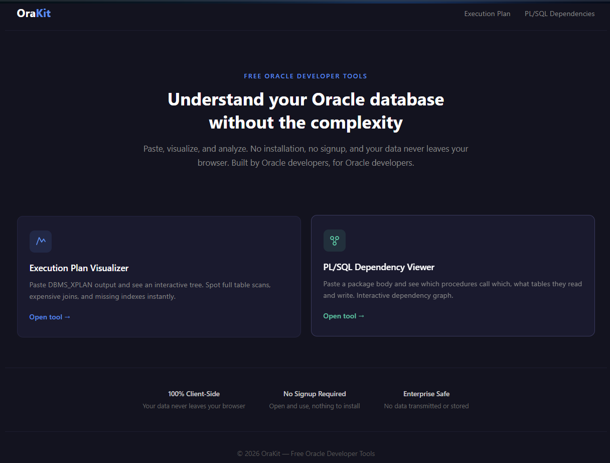
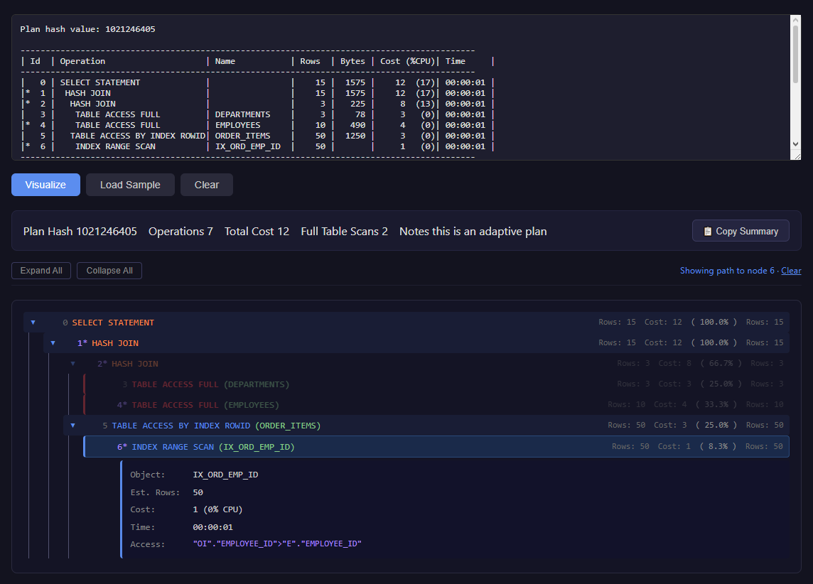
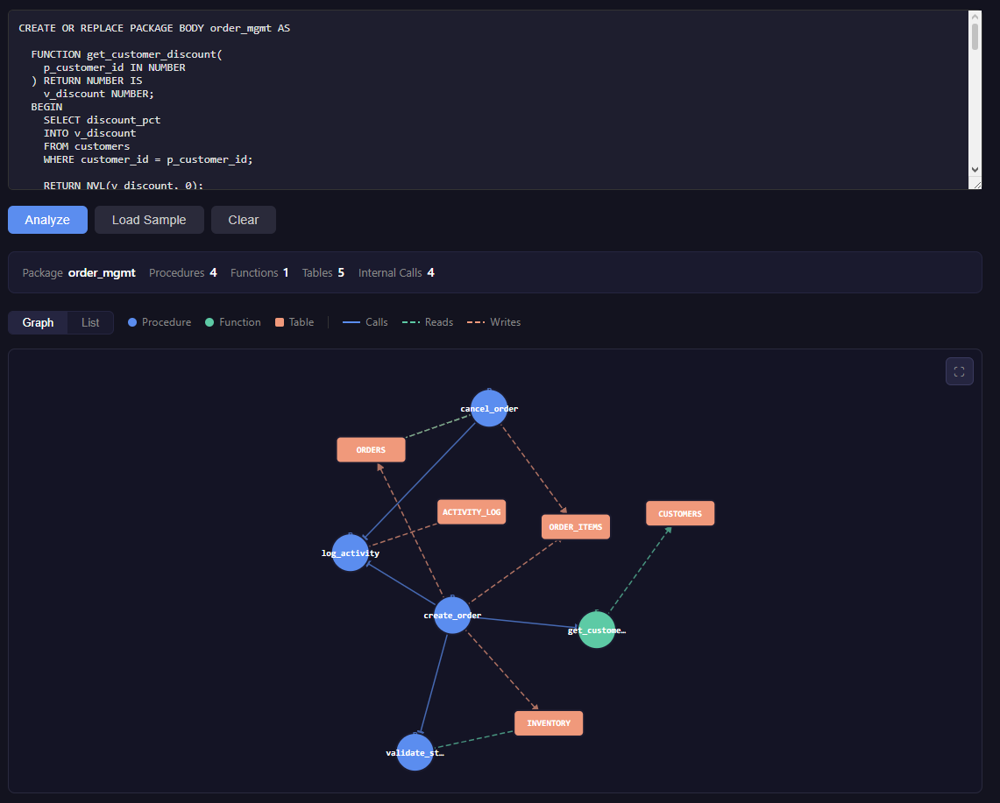

# OraKit

Free, browser-based developer tools for Oracle databases. Paste your execution plans, PL/SQL packages, or DDL statements and get interactive visualizations and analysis — no installation, no signup, and your data never leaves your browser. 

**Live:** [orakit.dev](https://orakit.dev)

> Source code is private. This repo serves as a public project showcase.



## Tools

## Execution Plan Visualizer

Parses Oracle `DBMS_XPLAN` output and renders it as an interactive collapsible tree with real-time analysis.


**Parser capabilities:**
- Dynamic column detection — reads the pipe-delimited header and maps columns by name, handling optional columns (`TempSpc`, `Pstart/Pstop`, `TQ`, `IN-OUT`, `PQ Distrib`) that shift positions when present
- Auto-detects `ALLSTATS LAST` format from `DISPLAY_CURSOR` — shows estimated vs actual rows side-by-side with color-coded divergence
- Handles line wrapping, suffixed numbers (K/M/G), memory statistics (`OMem`, `1Mem`, `Used-Mem`), and multiple output formats
- Extracts Predicate Information, Query Block Names, Column Projection, and Notes sections

**Interactive tree:**
- Click-to-expand detail panels, expand/collapse all, node selection with root-to-node path highlighting
- Cost percentage per node, visual indicators for full table scans and expensive operations (>50% of total cost)
- Summary bar: plan hash, operation count, total cost/buffers, full scan count, temp space usage
- Nested loop execution count display (`Loops: ×N`), suppressed in favor of real `Starts` when ALLSTATS data is available

**Analysis engine — 7 insight detectors:**

| Detector | What It Finds |
|----------|--------------|
| Correlated Subquery | `SORT AGGREGATE` with null cost; three confidence levels based on predicate availability |
| Expensive Full Scan | `TABLE ACCESS FULL` / `MAT_VIEW ACCESS FULL` >10% cost, >1K rows; recognizes parallel scans |
| Cartesian Join | Explicit `MERGE JOIN CARTESIAN` and implicit cartesians via `NESTED LOOPS` without access predicates |
| Temp Space Warning | Operations using ≥100MB temp (warning) or ≥1GB (critical) |
| Cost Imbalance | Hash joins where build side has ≥100:1 row ratio vs probe side, suggesting stale statistics |
| Index Recommendation | Filter predicates on full scans with >5K rows; skips function-wrapped columns, leading wildcards, and column-to-column comparisons |
| Cardinality Divergence | ALLSTATS plans where actual vs estimated rows diverge ≥10× (warning) or ≥100× (critical), normalized by `Starts` count |

## PL/SQL Dependency Viewer

Interactive dependency graph for Oracle PL/SQL packages. Paste a package body
and instantly visualize procedure calls, table reads/writes, and cross-package
dependencies.



### Features

- **Interactive graph** — d3.js force-directed layout with drag, zoom, pan,
  and click-to-focus highlighting. Procedures (blue), functions (green), and
  tables (orange) as distinct node types. Solid edges for calls, dashed for
  reads/writes.
- **List view** — collapsible structured alternative for large packages.
  Expandable entries show parameters, calls, callers, and table references
  with line numbers.
- **Multi-package support** — analyze up to 5 packages in separate tabs.
  Combined mode merges all packages into a unified graph with package
  clustering borders and purple cross-package call edges.
- **Fullscreen mode** — expand the graph to 95% viewport for complex
  dependency networks. Close with the × button or Escape key.
- **100% client-side** — all parsing runs in the browser. No data is
  uploaded, stored, or transmitted.

### What It Extracts

- Procedure and function declarations with parameters, direction, data types,
  and return types
- Internal calls between subprograms within the same package
- Table references from SELECT, INSERT, UPDATE, DELETE, MERGE, and JOIN
  statements (auto-classified as read or write)
- Cross-package calls matching `package_name.subprogram_name()` patterns
  against all loaded packages

### Parser Architecture

Multi-stage pipeline with independent modules:

1. **Comment stripper** — removes `--`, `/* */`, and string literal contents
   while preserving character positions for accurate line number reporting
2. **Block extractor** — finds PROCEDURE/FUNCTION declarations, extracts
   parameter lists, locates body boundaries via `END name;` or BEGIN/END
   depth tracking
3. **Call extractor** — matches references to declared subprogram names
   within each body
4. **Table extractor** — identifies table names from DML keywords with
   schema-qualified name support and deduplication
5. **Cross-package call extractor** — scans for `other_package.subprogram(`
   patterns against the registry of all analyzed packages

### Tech Stack

Angular 21 (standalone components, Angular Elements), TypeScript, d3.js
(d3-force, d3-selection, d3-zoom, d3-drag), SCSS

## Architecture

Built with **Angular 21** using the **Angular Elements** (Web Components) pattern — each tool is an Angular component registered as a custom element and embedded in its own static HTML page. This gives each tool an independent, SEO-optimized landing page while Angular handles the interactive functionality.

```
Static HTML pages (SEO-optimized)
  │
  └── Angular Elements (Web Components)
        └── Each tool = independent custom element
              └── 100% client-side processing

Hosting:
  Cloudflare (Full Strict SSL, CDN, WAF)
    └── Nginx (reverse proxy)
          └── Hetzner VPS
```

**Privacy by design:** All parsing and analysis happens in the browser. No data is transmitted to any server, making the tools safe for production database artifacts that may contain sensitive table or column names.

## Tech Stack

| Layer | Technologies |
|-------|-------------|
| **Frontend** | Angular 21, TypeScript, Angular Elements (Web Components) |
| **Infrastructure** | Hetzner VPS, Nginx, Cloudflare (Full Strict SSL, CDN, WAF) |

## Contact

- **Email:** nikolay.va.georgiev@gmail.com
- **LinkedIn:** [linkedin.com/in/nikolai-georgiev](https://www.linkedin.com/in/nikolai-georgiev-55b48a1a9)
- **GitHub:** [github.com/NikolayGeorgievv](https://github.com/NikolayGeorgievv)
